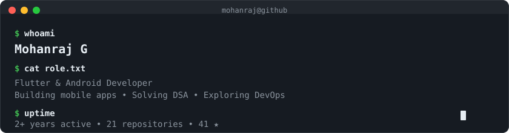
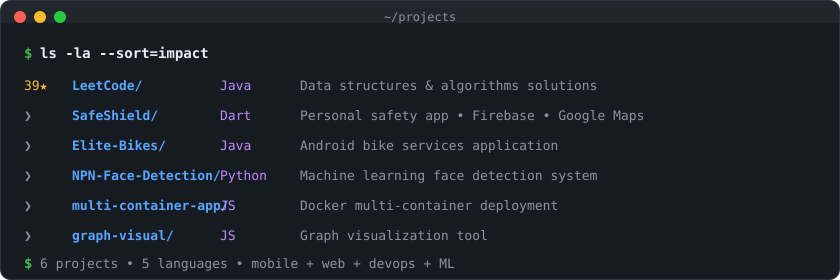
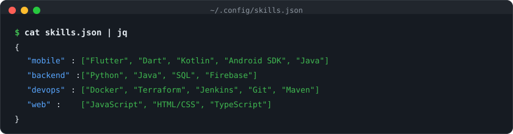
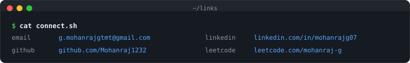

 

 

## Featured Projects

<table>
  <tr>
    <td width="33%" align="center">
      <a href="https://github.com/Mohanraj1232/LeetCode"><strong>LeetCode</strong></a> 
      39 &#x2605; &#x2022; Java &#x2022; DSA
    </td>
    <td width="33%" align="center">
      <a href="https://github.com/SafeShield2025/safeshieldproject"><strong>SafeShield</strong></a> 
      Flutter &#x2022; Firebase &#x2022; Maps
    </td>
    <td width="33%" align="center">
      <a href="https://github.com/Mohanraj1232/Elite-Bikes"><strong>Elite-Bikes</strong></a> 
      Java &#x2022; Kotlin &#x2022; Android
    </td>
  </tr>
  <tr>
    <td width="33%" align="center">
      <a href="https://github.com/Mohanraj1232/NPN-Face-Detection-Ml"><strong>Face Detection</strong></a> 
      Python &#x2022; ML &#x2022; OpenCV
    </td>
    <td width="33%" align="center">
      <a href="https://github.com/Mohanraj1232/multi-contanier-app"><strong>Multi-Container</strong></a> 
      Docker &#x2022; JavaScript
    </td>
    <td width="33%" align="center">
      <a href="https://github.com/Mohanraj1232/graph-visual"><strong>Graph Visual</strong></a> 
      JavaScript &#x2022; Visualization
    </td>
  </tr>
</table>

 

 

## Tech Stack

 

 

## Activity

<table>
  <tr>
    <td width="50%">
      <picture>
        <source media="(prefers-color-scheme: dark)" srcset="https://github-readme-stats.vercel.app/api?username=Mohanraj1232&show_icons=true&bg_color=161b22&title_color=58A6FF&text_color=e6edf3&icon_color=3FB950&hide_border=true&ring_color=3FB950" />
        <source media="(prefers-color-scheme: light)" srcset="https://github-readme-stats.vercel.app/api?username=Mohanraj1232&show_icons=true&bg_color=f6f8fa&title_color=0969da&text_color=1f2328&icon_color=1a7f37&hide_border=true&ring_color=1a7f37" />
        
      </picture>
    </td>
    <td width="50%">
      <picture>
        <source media="(prefers-color-scheme: dark)" srcset="https://leetcard.jacoblin.cool/mohanraj-g?theme=dark&font=JetBrains%20Mono&border=0&ext=contest" />
        <source media="(prefers-color-scheme: light)" srcset="https://leetcard.jacoblin.cool/mohanraj-g?theme=light&font=JetBrains%20Mono&border=0&ext=contest" />
        
      </picture>
    </td>
  </tr>
</table>

 

  <picture>
    <source media="(prefers-color-scheme: dark)" srcset="https://streak-stats.demolab.com/?user=Mohanraj1232&background=161b22&ring=58A6FF&fire=BC8CFF&currStreakLabel=3FB950&sideLabels=8b949e&dates=8b949e&currStreakNum=e6edf3&sideNums=e6edf3&hide_border=true" />
    <source media="(prefers-color-scheme: light)" srcset="https://streak-stats.demolab.com/?user=Mohanraj1232&background=f6f8fa&ring=0969da&fire=8250df&currStreakLabel=1a7f37&sideLabels=656d76&dates=656d76&currStreakNum=1f2328&sideNums=1f2328&hide_border=true" />
    
  </picture>

 

 

  <a href="mailto:g.mohanrajgtmt@gmail.com"><code>email</code></a> &nbsp;&#x2022;&nbsp;
  <a href="https://www.linkedin.com/in/mohanrajg07/"><code>linkedin</code></a> &nbsp;&#x2022;&nbsp;
  <a href="https://github.com/Mohanraj1232"><code>github</code></a> &nbsp;&#x2022;&nbsp;
  <a href="https://leetcode.com/mohanraj-g/"><code>leetcode</code></a>

