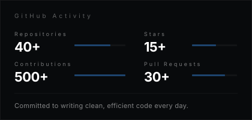

<table width="100%" border="0" cellspacing="0" cellpadding="0">
<tr>
<td width="60%" valign="top">

<picture>
  <source media="(prefers-color-scheme: dark)" srcset="./banner.svg">
  <source media="(prefers-color-scheme: light)" srcset="./banner.svg">
  
</picture>

</td>
<td width="40%" align="center" valign="center">


</td>
</tr>
</table>

<br/>

<table width="100%" border="0" cellspacing="0" cellpadding="0">
<tr>
<td width="55%" valign="top">

### `ABOUT`

```
Computer Science student and software
developer passionate about building
practical solutions and turning ideas
into meaningful digital experiences.
```

<sub>&#x2500;&#x2500;&#x2500;&#x2500;&#x2500;&#x2500;&#x2500;&#x2500;&#x2500;&#x2500;&#x2500;&#x2500;&#x2500;&#x2500;&#x2500;&#x2500;</sub>

&nbsp;&nbsp;`CURRENTLY`&nbsp;&nbsp;Building full-stack web applications  
&nbsp;&nbsp;`LEARNING`&nbsp;&nbsp;&nbsp;System Design & Cloud Architecture  
&nbsp;&nbsp;`FOCUS`&nbsp;&nbsp;&nbsp;&nbsp;&nbsp;&nbsp;Clean code & efficient solutions

</td>
<td width="45%" valign="top">

### `CONNECT`

<br/>

[](https://mohanraj-portfolio.vercel.app)
[](https://www.linkedin.com/in/mohanrajg07/)
[](mailto:g.mohanrajgtmt@gmail.com)
[](https://leetcode.com/mohanraj-g)

<br/>

<sub>Open to collaborations and opportunities</sub>

</td>
</tr>
</table>

<br/>

<div align="center">


</div>

<br/>

---

<br/>

<div align="center">



</div>

<br/>

<div align="center">


</div>

<br/>

---

<br/>

<div align="center">


</div>

<br/>

---

<br/>

<div align="center">


</div>

<br/>

---

<br/>

<div align="center">
<sub>
<code>BUILDING THOUGHTFUL DIGITAL EXPERIENCES</code>
<br/><br/>

</sub>
</div>
