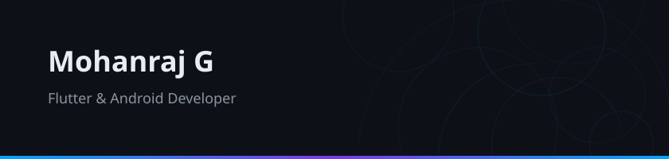
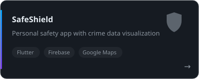
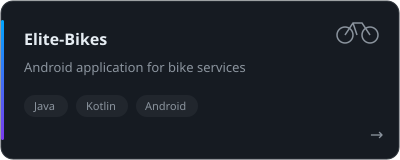
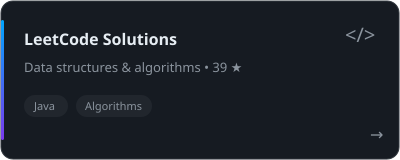
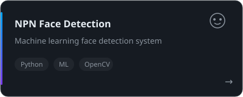
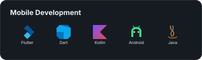
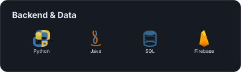
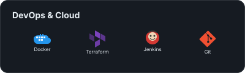
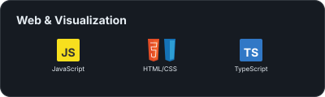

<table>
  <tr>
    <td width="50%" valign="top">
       
      

        
      

      

        Passionate about building clean, efficient mobile applications. I specialize in Flutter and Android development, turning ideas into polished cross-platform experiences. Currently exploring DevOps and machine learning.
      

    </td>
    <td width="50%" valign="top">
       
      <picture>
        <source media="(prefers-color-scheme: dark)" srcset="https://github-readme-stats.vercel.app/api?username=Mohanraj1232&show_icons=true&bg_color=161b22&title_color=00A6FF&text_color=e6edf3&icon_color=7C3AED&hide_border=true" />
        <source media="(prefers-color-scheme: light)" srcset="https://github-readme-stats.vercel.app/api?username=Mohanraj1232&show_icons=true&bg_color=f6f8fa&title_color=00A6FF&text_color=1f2328&icon_color=7C3AED&hide_border=true" />
        
      </picture>
    </td>
  </tr>
</table>

## Featured Projects

<table>
  <tr>
    <td width="50%">
      
    </td>
    <td width="50%">
      
    </td>
  </tr>
  <tr>
    <td width="50%">
      
    </td>
    <td width="50%">
      
    </td>
  </tr>
</table>

## Tech Stack

<table>
  <tr>
    <td width="50%"></td>
    <td width="50%"></td>
  </tr>
  <tr>
    <td width="50%"></td>
    <td width="50%"></td>
  </tr>
</table>

## Activity

<table>
  <tr>
    <td width="50%">
      <picture>
        <source media="(prefers-color-scheme: dark)" srcset="https://github-readme-stats.vercel.app/api?username=Mohanraj1232&show_icons=true&bg_color=0d1117&title_color=00A6FF&text_color=e6edf3&icon_color=7C3AED&hide_border=true" />
        <source media="(prefers-color-scheme: light)" srcset="https://github-readme-stats.vercel.app/api?username=Mohanraj1232&show_icons=true&bg_color=f6f8fa&title_color=00A6FF&text_color=1f2328&icon_color=7C3AED&hide_border=true" />
        
      </picture>
    </td>
    <td width="50%">
      <picture>
        <source media="(prefers-color-scheme: dark)" srcset="https://leetcard.jacoblin.cool/mohanraj-g?theme=dark&font=Noto%20Sans&border=0&ext=contest" />
        <source media="(prefers-color-scheme: light)" srcset="https://leetcard.jacoblin.cool/mohanraj-g?theme=light&font=Noto%20Sans&border=0&ext=contest" />
        
      </picture>
    </td>
  </tr>
</table>

  <picture>
    <source media="(prefers-color-scheme: dark)" srcset="https://streak-stats.demolab.com/?user=Mohanraj1232&background=0d1117&ring=00A6FF&fire=7C3AED&currStreakLabel=00A6FF&hide_border=true" />
    <source media="(prefers-color-scheme: light)" srcset="https://streak-stats.demolab.com/?user=Mohanraj1232&background=f6f8fa&ring=00A6FF&fire=7C3AED&currStreakLabel=00A6FF&hide_border=true" />
    
  </picture>

## Connect

  
  &nbsp;&nbsp;&nbsp;
  
  &nbsp;&nbsp;&nbsp;
  
  &nbsp;&nbsp;&nbsp;
  

  

