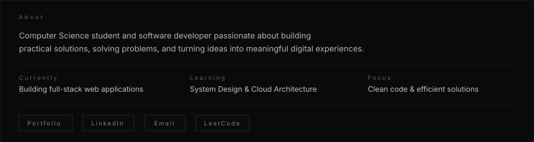

<picture>
  <source media="(prefers-color-scheme: dark)" srcset="./banner.svg">
  <source media="(prefers-color-scheme: light)" srcset="./banner.svg">
  
</picture>

 

 

 

---

 

 

 

---

 

 

---

 

 

<picture>
  <source media="(prefers-color-scheme: dark)" srcset="https://raw.githubusercontent.com/Mohanraj1232/Mohanraj1232/output/snake.svg"/>
  
</picture>

 

---

 

<code>BUILDING THOUGHTFUL DIGITAL EXPERIENCES</code>
  

